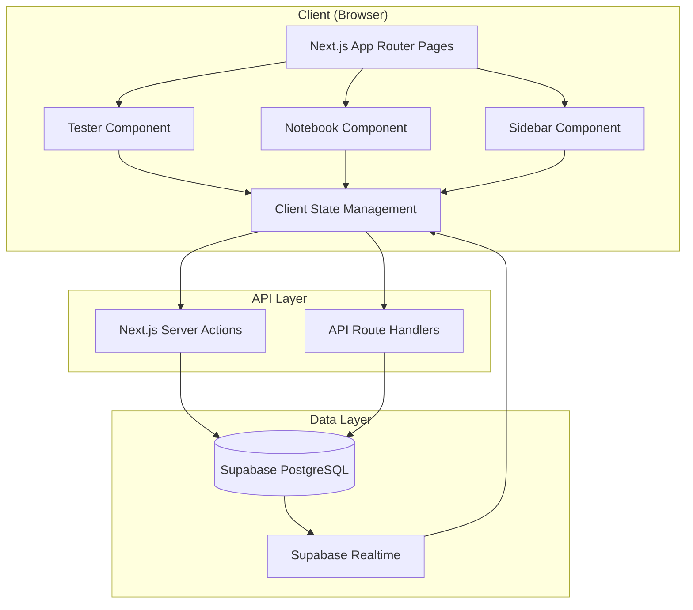

# Design Document: KrokBook

## Overview

KrokBook is a Next.js 14 web application built with TypeScript that provides a split-screen interface for medical exam preparation. The application architecture follows a client-server model with React Server Components for data fetching and Client Components for interactive features. The design emphasizes real-time data synchronization, automatic error tracking, and a seamless user experience across study modes.

The application consists of three main architectural layers:
1. **Presentation Layer**: Next.js App Router pages and React components (Tester, Notebook, Sidebar)
2. **Business Logic Layer**: Client-side state management and data transformation logic
3. **Data Layer**: Supabase PostgreSQL database with real-time subscriptions

## Architecture

### High-Level Architecture



### Component Architecture

The application uses a modular component structure:

- **Layout Components**: Root layout with sidebar navigation
- **Page Components**: Main dashboard, Error Hub, Mock Exam
- **Feature Components**: Tester, Notebook, Upload Modal
- **UI Components**: Shadcn UI primitives (Button, Card, Tabs, etc.)

### State Management Strategy

The application uses a combination of:
- **React Server Components**: For initial data fetching and SEO
- **Client State (useState/useReducer)**: For UI interactions and local state
- **Supabase Realtime**: For automatic data synchronization across tabs/devices
- **URL State (searchParams)**: For shareable state like selected folder and question

## Components and Interfaces

### Database Schema

```typescript
// Supabase Tables

interface Folder {
  id: string;
  name: string;
  created_at: string;
  updated_at: string;
}

interface Question {
  id: string;
  folder_id: string;
  question_text: string;
  answer_options: string[]; // Array of answer strings
  correct_answer_index: number; // 0-based index
  created_at: string;
}

interface NotebookPage {
  id: string;
  folder_id: string;
  content: string; // Tiptap JSON content
  updated_at: string;
}

interface UserError {
  id: string;
  question_id: string;
  user_selected_index: number;
  explanation: string | null; // User's notes on why they got it wrong
  created_at: string;
}
```

### Core Components

#### 1. Sidebar Component

```typescript
interface SidebarProps {
  folders: Folder[];
  selectedFolderId: string | null;
  onFolderSelect: (folderId: string) => void;
  onUploadClick: () => void;
  onErrorHubClick: () => void;
  onMockExamClick: () => void;
}

// Responsibilities:
// - Display list of folders
// - Handle navigation between folders
// - Trigger upload modal
// - Navigate to Error Hub and Mock Exam
```

#### 2. Tester Component

```typescript
type TestMode = 'study' | 'review';

interface TesterProps {
  questions: Question[];
  mode: TestMode;
  onModeToggle: () => void;
  onAnswerSelect: (questionId: string, selectedIndex: number) => void;
  currentQuestionIndex: number;
  onNavigate: (direction: 'next' | 'prev') => void;
}

interface TesterState {
  searchQuery: string;
  filteredQuestions: Question[];
  answeredQuestions: Map<string, number>; // questionId -> selectedIndex
  revealedAnswers: Set<string>; // questionIds where answer is revealed
}

// Responsibilities:
// - Display questions with answer options
// - Handle answer selection and validation
// - Filter questions based on search
// - Trigger error recording on incorrect answers
// - Manage question navigation
```

#### 3. Notebook Component

```typescript
type NotebookTab = 'notes' | 'errors';

interface NotebookProps {
  folderId: string;
  notebookContent: string; // Tiptap JSON
  errorQuestions: QuestionWithError[];
  activeTab: NotebookTab;
  onTabChange: (tab: NotebookTab) => void;
  onNotesUpdate: (content: string) => void;
  onErrorExplanationUpdate: (errorId: string, explanation: string) => void;
}

interface QuestionWithError {
  question: Question;
  error: UserError;
}

// Responsibilities:
// - Render Tiptap editor for notes
// - Display error questions with user explanations
// - Save notes and explanations to database
// - Switch between Notes and Error Work tabs
```

#### 4. Upload Modal Component

```typescript
type UploadMethod = 'text' | 'file';

interface UploadModalProps {
  isOpen: boolean;
  onClose: () => void;
  folders: Folder[];
  onUploadComplete: () => void;
}

interface ParsedQuestion {
  questionText: string;
  answerOptions: string[];
  correctAnswerIndex: number;
  isValid: boolean;
  validationErrors: string[];
  sourceFile?: string; // Optional: name of file this question came from
}

interface UploadState {
  uploadMethod: UploadMethod;
  rawText: string;
  selectedFiles: File[];
  parsedQuestions: ParsedQuestion[];
  selectedFolderId: string | null;
  newFolderName: string;
  isCreatingNewFolder: boolean;
  isUploading: boolean;
  isProcessingFiles: boolean;
}

// Responsibilities:
// - Accept raw text input OR file uploads
// - Support multiple file selection (.txt and .docx)
// - Extract text from .txt and .docx files
// - Parse text into structured questions
// - Validate parsed questions
// - Allow folder selection or creation
// - Save questions to database
```

#### 5. Error Hub Component

```typescript
interface ErrorHubProps {
  errorsByFolder: Map<string, QuestionWithError[]>;
  folders: Folder[];
  onFolderClick: (folderId: string) => void;
}

interface ErrorStats {
  folderId: string;
  folderName: string;
  errorCount: number;
  recentErrors: QuestionWithError[];
}

// Responsibilities:
// - Display errors grouped by folder
// - Show error counts per subject
// - Navigate to folder when clicked
```

#### 6. Mock Exam Component

```typescript
interface MockExamProps {
  questions: Question[]; // 200 random questions
  onComplete: (results: ExamResults) => void;
  onExit: () => void;
}

interface ExamResults {
  totalQuestions: number;
  correctAnswers: number;
  incorrectAnswers: number;
  percentage: number;
  errorRecords: UserError[];
}

interface MockExamState {
  currentQuestionIndex: number;
  answers: Map<string, number>; // questionId -> selectedIndex
  isComplete: boolean;
}

// Responsibilities:
// - Generate 200 random questions from all folders
// - Track user answers
// - Create error records for incorrect answers
// - Display progress indicator
// - Show results summary on completion
```

### Data Access Layer

```typescript
// Server Actions for data mutations

async function createFolder(name: string): Promise<Folder>;

async function uploadQuestions(
  folderId: string, 
  questions: ParsedQuestion[]
): Promise<void>;

async function saveNotebookContent(
  folderId: string, 
  content: string
): Promise<void>;

async function createUserError(
  questionId: string, 
  selectedIndex: number
): Promise<UserError>;

async function updateErrorExplanation(
  errorId: string, 
  explanation: string
): Promise<void>;

// Data fetching functions

async function getFolders(): Promise<Folder[]>;

async function getQuestionsByFolder(folderId: string): Promise<Question[]>;

async function getNotebookContent(folderId: string): Promise<string>;

async function getUserErrors(): Promise<UserError[]>;

async function getErrorsByFolder(folderId: string): Promise<QuestionWithError[]>;

async function getRandomQuestions(count: number): Promise<Question[]>;
```

## Data Models

### File Upload Processing

The system supports uploading questions from multiple sources: direct text input, .txt files, and .docx files.

**Supported File Formats:**

1. **.txt files**: Plain text files containing questions in the expected format
   - Read using browser File API
   - Text encoding: UTF-8 (supports both English and Ukrainian)
   - Multiple files can be selected and processed together

2. **.docx files**: Microsoft Word documents containing questions
   - Parsed using the `mammoth` library to extract plain text
   - Formatting is stripped, only text content is preserved
   - Multiple files can be selected and processed together

**File Processing Flow:**

```typescript
interface FileProcessor {
  // Process uploaded files and extract text content
  processFiles(files: File[]): Promise<FileProcessingResult[]>;
}

interface FileProcessingResult {
  fileName: string;
  textContent: string;
  success: boolean;
  error?: string;
}

// Implementation approach:
async function processFiles(files: File[]): Promise<FileProcessingResult[]> {
  const results: FileProcessingResult[] = [];
  
  for (const file of files) {
    try {
      let textContent: string;
      
      if (file.name.endsWith('.txt')) {
        // Read .txt file as text
        textContent = await file.text();
      } else if (file.name.endsWith('.docx')) {
        // Extract text from .docx using mammoth
        const arrayBuffer = await file.arrayBuffer();
        const result = await mammoth.extractRawText({ arrayBuffer });
        textContent = result.value;
      } else {
        throw new Error(`Unsupported file type: ${file.name}`);
      }
      
      results.push({
        fileName: file.name,
        textContent,
        success: true
      });
    } catch (error) {
      results.push({
        fileName: file.name,
        textContent: '',
        success: false,
        error: error.message
      });
    }
  }
  
  return results;
}

// After processing files, combine all text content and parse
function combineAndParse(results: FileProcessingResult[]): ParsedQuestion[] {
  // Combine all successful text extractions
  const combinedText = results
    .filter(r => r.success)
    .map(r => r.textContent)
    .join('\n\n'); // Separate files with double newline
  
  // Parse combined text using existing parser
  return parseRawText(combinedText);
}
```

**File Upload UI Flow:**

1. User clicks "Upload Database" button
2. Modal displays two options:
   - Tab 1: "Paste Text" - Text area for direct input
   - Tab 2: "Upload Files" - File input accepting .txt and .docx files
3. User selects upload method:
   - **Text Input**: User pastes text directly
   - **File Upload**: User selects one or more files
4. System processes input:
   - For text: Parse immediately
   - For files: Extract text from each file, then parse combined content
5. Display preview of all parsed questions with source file names
6. User selects destination folder and confirms
7. System saves all valid questions to database

**Error Handling:**

- If file reading fails: Display error message with file name
- If .docx extraction fails: Display error message suggesting file may be corrupted
- If parsing fails: Display validation errors per question
- Allow user to retry or switch to text input method

### Question Parser

The Database_Parser component processes raw text input into structured question objects. The parser supports multiple input formats and languages.

**Supported Input Formats:**

Format 1 - Explicit "Correct:" line:
```
Question text here?
A) First answer option
B) Second answer option
C) Third answer option
D) Fourth answer option
Correct: B
```

Format 2 - Asterisk before answer text:
```
Question text here?
A) *First answer option
B) Second answer option
C) Third answer option
```

Format 3 - Asterisk after answer text:
```
Question text here?
A) First answer option*
B) Second answer option
C) Third answer option
```

Format 4 - "ANSWER:" keyword at end:
```
Question text here?
A) First answer option
B) Second answer option
C) Third answer option
ANSWER: A
```

Format 5 - Ukrainian "ВІДПОВІДЬ:" keyword:
```
Текст питання?
А) Перший варіант
Б) Другий варіант
В) Третій варіант
ВІДПОВІДЬ: А
```

**Language Support:**
- English: A, B, C, D, E, F, G, H, I, J
- Ukrainian: А, Б, В, Г, Д, Е, Є, Ж, З, И (Cyrillic letters)
- Mixed content: Questions can contain both English and Ukrainian text

**Parsing Algorithm:**

1. Split input by double newlines to separate questions
2. For each question block:
   - Extract question text (first line ending with ?)
   - Extract answer options (lines matching pattern: `[A-JА-И][\):]`)
   - Detect correct answer using multiple strategies (in priority order):
     a. Check for asterisk before answer text: `А) *Text`
     b. Check for asterisk after answer text: `А) Text*`
     c. Check for "ANSWER:" or "ВІДПОВІДЬ:" line (case-insensitive)
     d. Check for "Correct:" line (legacy format)
   - Map correct answer letter to zero-based index
   - Validate that correct answer matches one of the options
3. Return array of ParsedQuestion objects with validation status

**Answer Detection Logic:**

```typescript
function detectCorrectAnswer(lines: string[], answerOptions: AnswerOption[]): number | null {
  // Strategy 1: Check for asterisk before answer text
  for (let i = 0; i < answerOptions.length; i++) {
    const option = answerOptions[i];
    if (option.text.trim().startsWith('*')) {
      return i; // Return zero-based index
    }
  }
  
  // Strategy 2: Check for asterisk after answer text
  for (let i = 0; i < answerOptions.length; i++) {
    const option = answerOptions[i];
    if (option.text.trim().endsWith('*')) {
      return i;
    }
  }
  
  // Strategy 3: Check for "ANSWER:" or "ВІДПОВІДЬ:" keyword (case-insensitive)
  const answerKeywordRegex = /^(answer|відповідь):\s*([A-JА-И])/i;
  for (const line of lines) {
    const match = line.match(answerKeywordRegex);
    if (match) {
      const letter = match[2].toUpperCase();
      return findAnswerIndexByLetter(letter, answerOptions);
    }
  }
  
  // Strategy 4: Check for "Correct:" keyword (legacy format)
  const correctRegex = /^correct:\s*([A-JА-И])/i;
  for (const line of lines) {
    const match = line.match(correctRegex);
    if (match) {
      const letter = match[1].toUpperCase();
      return findAnswerIndexByLetter(letter, answerOptions);
    }
  }
  
  return null; // No valid answer format detected
}

function findAnswerIndexByLetter(letter: string, options: AnswerOption[]): number | null {
  for (let i = 0; i < options.length; i++) {
    if (options[i].letter.toUpperCase() === letter.toUpperCase()) {
      return i;
    }
  }
  return null;
}
```

**Validation Rules:**
- Question text must end with "?"
- Must have at least 2 answer options
- Must have exactly one correct answer
- Correct answer must reference a valid option letter
- Answer options should be sequential (A, B, C, D... or А, Б, В, Г...)
- If multiple answer indicators are present, the first valid one is used
- Asterisks in answer text are stripped after detection

### Tiptap Editor Configuration

The Notebook uses Tiptap with the following extensions:
- StarterKit (basic formatting)
- Placeholder
- Typography (smart quotes, em dashes)

Content is stored as JSON in the database and rendered as HTML in the editor.

### Error Tracking Logic

**Automatic Error Recording Flow:**

1. User selects an answer in Study Mode
2. System compares selected index with correct_answer_index
3. If incorrect:
   - Create UserError record with question_id and user_selected_index
   - Fetch the question details
   - Append question to "Error Work" tab in Notebook
   - Display visual feedback (red highlight, correct answer revealed)
4. If correct:
   - Display visual feedback (green highlight)
   - No error record created

**Error Work Tab Display:**

Each error entry shows:
- Question text
- User's incorrect answer (highlighted in red)
- Correct answer (highlighted in green)
- Tiptap editor for user explanation
- Timestamp of error

## Correctness Properties

*A property is a characteristic or behavior that should hold true across all valid executions of a system—essentially, a formal statement about what the system should do. Properties serve as the bridge between human-readable specifications and machine-verifiable correctness guarantees.*


### Property Reflection

After analyzing all acceptance criteria, I've identified several areas of redundancy:

1. **Error Record Creation (3.3 and 7.1)**: Both test that incorrect answers create error records - these are identical and should be combined into one property.

2. **Error Work Tab Updates (3.4 and 7.2)**: Both test that error records appear in the Error Work tab - these are identical and should be combined.

3. **Search Filtering (5.1 and 5.2)**: 5.1 tests that filtering happens, 5.2 tests that results match the query. 5.2 is more comprehensive and subsumes 5.1.

4. **Folder Selection Loading (1.2 and 1.3)**: Both test that selecting a folder loads associated data. These can be combined into one property about folder selection loading all associated data.

5. **Note Persistence (6.3, 7.5, 11.1)**: Multiple criteria test that changes are saved. These can be combined into a general persistence property.

After reflection, I'll focus on unique, non-redundant properties that provide maximum validation value.

### Correctness Properties

#### Property 1: Folder Selection Loads Associated Data
*For any* Subject_Folder, when selected, the system should load both the associated questions into the Tester and the notebook content into the Notebook.

**Validates: Requirements 1.2, 1.3**

#### Property 2: Parser Produces Valid Question Objects
*For any* valid raw text input following the expected format, the Database_Parser should produce structured question objects with all required fields (question_text, answer_options, correct_answer_index).

**Validates: Requirements 2.2**

#### Property 3: Valid Questions Are Persisted
*For any* set of valid parsed questions, confirming the upload should result in all questions being saved to the database with the correct folder association.

**Validates: Requirements 2.4**

#### Property 4: Invalid Input Produces Error Messages
*For any* invalid raw text input (missing correct answer, fewer than 2 options, malformed format), the Database_Parser should produce specific validation error messages.

**Validates: Requirements 2.5**

#### Property 5: Incorrect Answers Create Error Records
*For any* question answered incorrectly in Study_Mode, the system should create an Error_Record in the database linking the question to the user's selected answer.

**Validates: Requirements 3.3, 7.1**

#### Property 6: Error Records Appear in Error Work Tab
*For any* Error_Record created, the associated question should automatically appear in the "Error Work" tab of the Notebook for the corresponding folder.

**Validates: Requirements 3.4, 7.2**

#### Property 7: Review Mode Never Creates Errors
*For any* answer selection in Review_Mode, no Error_Record should be created in the database, regardless of whether the answer is correct or incorrect.

**Validates: Requirements 4.2**

#### Property 8: Mode Switching Preserves Question Position
*For any* current question position, toggling between Study_Mode and Review_Mode should maintain the same question index.

**Validates: Requirements 4.4**

#### Property 9: Search Results Match Query
*For any* search query, all displayed questions should contain the query string in either the question_text or at least one answer_option.

**Validates: Requirements 5.1, 5.2**

#### Property 10: Search Clear Restores Full List
*For any* question list, applying a search filter and then clearing it should restore the original complete list of questions.

**Validates: Requirements 5.3**

#### Property 11: Content Persistence Round Trip
*For any* notebook content or error explanation, saving the content and then reloading it should produce identical content.

**Validates: Requirements 6.3, 7.5, 11.1**

#### Property 12: Folder Switch Loads Correct Notes
*For any* two different Subject_Folders with different notebook content, switching from one to the other should load the correct notebook content for the destination folder.

**Validates: Requirements 6.4**

#### Property 13: Error Work Tab Shows All Folder Errors
*For any* Subject_Folder, the "Error Work" tab should display all and only the Error_Records associated with questions in that folder.

**Validates: Requirements 7.3**

#### Property 14: Error Hub Groups By Folder
*For any* set of Error_Records across multiple folders, the Error_Hub should group them such that all errors for the same folder appear together.

**Validates: Requirements 8.2**

#### Property 15: Error Count Accuracy
*For any* Subject_Folder displayed in the Error_Hub, the displayed error count should equal the actual number of Error_Records for that folder.

**Validates: Requirements 8.3**

#### Property 16: Error Hub Sorts By Timestamp
*For any* group of errors within a subject in the Error_Hub, the errors should be ordered with the most recent (highest timestamp) first.

**Validates: Requirements 8.5**

#### Property 17: Mock Exam Contains 200 Questions
*For any* mock exam generation, the resulting question set should contain exactly 200 questions randomly selected from all available folders.

**Validates: Requirements 9.1**

#### Property 18: Mock Exam Tracks Errors
*For any* incorrect answer during a Mock_Exam, an Error_Record should be created just as in normal Study_Mode.

**Validates: Requirements 9.3**

#### Property 19: Mock Exam Progress Accuracy
*For any* question index during a Mock_Exam, the displayed progress should accurately reflect the current position (e.g., question N of 200).

**Validates: Requirements 9.4**

#### Property 20: Mock Exam Results Accuracy
*For any* completed Mock_Exam, the summary statistics (correct count, incorrect count, percentage) should accurately reflect the user's answers.

**Validates: Requirements 9.5**

#### Property 21: Database Operations Complete Before Confirmation
*For any* upload operation, the system should not display a success confirmation until all questions have been successfully persisted to the database.

**Validates: Requirements 11.3**

#### Property 22: Database Failures Show Error Messages
*For any* database operation that fails, the system should display an error message to the user and provide a retry option.

**Validates: Requirements 11.4**

#### Property 23: Stored Questions Have Required Fields
*For any* question stored in the database, it should have all required fields: question_text (non-empty), answer_options (array), correct_answer_index (number), and folder_id.

**Validates: Requirements 12.1**

#### Property 24: Parser Validates Minimum Options
*For any* question with fewer than 2 answer options, the Database_Parser should mark it as invalid and include a validation error.

**Validates: Requirements 12.2**

#### Property 25: Parser Validates Single Correct Answer
*For any* question without exactly one correct answer specified, the Database_Parser should mark it as invalid and include a validation error.

**Validates: Requirements 12.3**

#### Property 26: Parser Validates Option Count Bounds
*For any* question with fewer than 2 or more than 10 answer options, the Database_Parser should mark it as invalid.

**Validates: Requirements 12.4**

#### Property 27: Answer Order Preservation
*For any* question with a specific order of answer options, storing and then retrieving the question should preserve the exact order of options.

**Validates: Requirements 12.5**

#### Property 28: Ukrainian Language Support
*For any* valid question written in Ukrainian (Cyrillic script) with Ukrainian answer labels (А, Б, В, Г, Д), the Database_Parser should correctly parse the question text, answer options, and detect the correct answer.

**Validates: Requirements 13.1, 13.2, 13.3**

#### Property 29: Mixed Language Content Support
*For any* database containing both English and Ukrainian questions, the Database_Parser should correctly parse all questions regardless of language.

**Validates: Requirements 13.5**

#### Property 30: Legacy "Correct:" Format Detection
*For any* question using the format "Correct: A" (or any valid letter), the Database_Parser should correctly detect the correct answer index.

**Validates: Requirements 14.1**

#### Property 31: Asterisk Before Answer Detection
*For any* question where the correct answer is marked with an asterisk before the text (e.g., "А) *Text"), the Database_Parser should correctly detect the correct answer index and strip the asterisk from the stored text.

**Validates: Requirements 14.2**

#### Property 32: Asterisk After Answer Detection
*For any* question where the correct answer is marked with an asterisk after the text (e.g., "А) Text*"), the Database_Parser should correctly detect the correct answer index and strip the asterisk from the stored text.

**Validates: Requirements 14.3**

#### Property 33: "ANSWER:" Keyword Detection
*For any* question using the format "ANSWER: A" (case-insensitive), the Database_Parser should correctly detect the correct answer index.

**Validates: Requirements 14.4**

#### Property 34: Ukrainian "ВІДПОВІДЬ:" Keyword Detection
*For any* question using the Ukrainian format "ВІДПОВІДЬ: А" (case-insensitive), the Database_Parser should correctly detect the correct answer index.

**Validates: Requirements 14.5**

#### Property 35: Format Variation Robustness
*For any* question with variations in spacing around asterisks or keywords (extra spaces, tabs, etc.), the Database_Parser should correctly detect the correct answer.

**Validates: Requirements 14.6**

#### Property 36: Multiple Format Indicator Priority
*For any* question containing multiple answer format indicators, the Database_Parser should use the first valid indicator according to the priority order (asterisk before > asterisk after > ANSWER/ВІДПОВІДЬ > Correct).

**Validates: Requirements 14.7**

#### Property 37: Missing Answer Format Error
*For any* question without a valid answer format indicator, the Database_Parser should mark it as invalid and provide a descriptive error message indicating no answer format was detected.

**Validates: Requirements 14.8**

#### Property 38: TXT File Processing
*For any* .txt file containing valid question text in the expected format, the file processor should successfully extract the text content and the parser should produce valid ParsedQuestion objects.

**Validates: Requirements 2.3**

#### Property 39: DOCX File Processing
*For any* .docx file containing valid question text in the expected format, the file processor should successfully extract the text content and the parser should produce valid ParsedQuestion objects.

**Validates: Requirements 2.4**

#### Property 40: Multiple File Combination
*For any* set of multiple files (txt or docx), the system should parse all files and combine the results such that the total number of parsed questions equals the sum of questions from each individual file.

**Validates: Requirements 2.5**

## Error Handling

### Client-Side Error Handling

**Network Errors:**
- All Supabase operations wrapped in try-catch blocks
- Display toast notifications for failed operations
- Provide retry buttons for failed mutations
- Graceful degradation when offline (show cached data with warning)

**Validation Errors:**
- Real-time validation feedback in forms
- Clear error messages for invalid inputs
- Prevent submission of invalid data
- Highlight specific fields with errors

**Parser Errors:**
- Display line-by-line validation results
- Show specific error messages (e.g., "Question 3: Missing correct answer")
- Allow users to edit and re-parse without losing progress
- Provide example format when parsing fails

### Server-Side Error Handling

**Database Errors:**
- Log all database errors for debugging
- Return user-friendly error messages (hide implementation details)
- Use database transactions for multi-step operations
- Rollback on failure to maintain consistency

**Authentication Errors:**
- Redirect to login on session expiration
- Clear error messages for auth failures
- Preserve user's intended action after login

### Error Recovery Strategies

1. **Optimistic Updates**: Update UI immediately, rollback on failure
2. **Retry Logic**: Automatic retry for transient network errors (max 3 attempts)
3. **Data Sync**: Periodic background sync to catch missed updates
4. **Local Storage Backup**: Save draft notes locally before persisting

## Testing Strategy

### Dual Testing Approach

The testing strategy employs both unit tests and property-based tests to ensure comprehensive coverage:

- **Unit Tests**: Verify specific examples, edge cases, and error conditions
- **Property Tests**: Verify universal properties across all inputs using randomized test data

Both approaches are complementary and necessary. Unit tests catch concrete bugs in specific scenarios, while property tests verify general correctness across a wide range of inputs.

### Property-Based Testing Configuration

**Library Selection:**
- Use **fast-check** for TypeScript/JavaScript property-based testing
- Minimum 100 iterations per property test (due to randomization)
- Each property test must reference its design document property

**Test Tagging Format:**
```typescript
// Feature: krokbook, Property 5: Incorrect Answers Create Error Records
test('incorrect answers in study mode create error records', async () => {
  await fc.assert(
    fc.asyncProperty(
      questionArbitrary,
      incorrectAnswerIndexArbitrary,
      async (question, incorrectIndex) => {
        // Test implementation
      }
    ),
    { numRuns: 100 }
  );
});
```

**Property Test Requirements:**
- Each correctness property MUST be implemented by a SINGLE property-based test
- Tests must use appropriate generators (arbitraries) for input data
- Tests must verify the property holds for all generated inputs
- Tests must be tagged with feature name and property number

### Unit Testing Strategy

**Focus Areas for Unit Tests:**
- Specific examples demonstrating correct behavior
- Edge cases (empty lists, boundary values, special characters)
- Error conditions (invalid inputs, network failures)
- Integration points between components
- UI interactions and state transitions

**Balance:**
- Avoid writing too many unit tests for scenarios covered by property tests
- Focus unit tests on concrete examples and edge cases
- Use property tests for comprehensive input coverage

### Test Organization

```
__tests__/
├── unit/
│   ├── components/
│   │   ├── Tester.test.tsx
│   │   ├── Notebook.test.tsx
│   │   ├── UploadModal.test.tsx
│   │   └── ErrorHub.test.tsx
│   ├── lib/
│   │   ├── parser.test.ts
│   │   └── validation.test.ts
│   └── actions/
│       └── database.test.ts
└── properties/
    ├── error-tracking.property.test.ts
    ├── search.property.test.ts
    ├── parser.property.test.ts
    ├── persistence.property.test.ts
    └── mock-exam.property.test.ts
```

### Testing Tools

- **Test Runner**: Vitest (fast, ESM-native)
- **React Testing**: @testing-library/react
- **Property Testing**: fast-check
- **Mocking**: Vitest mocks for Supabase client
- **E2E Testing**: Playwright (for critical user flows)

### Key Test Scenarios

**Parser Testing:**
- Property: Valid format produces valid questions (Property 2)
- Property: Invalid format produces errors (Property 4)
- Property: TXT file processing (Property 38)
- Property: DOCX file processing (Property 39)
- Property: Multiple file combination (Property 40)
- Unit: Specific malformed inputs (missing question mark, duplicate options)
- Unit: Edge cases (special characters, very long text, Unicode)
- Unit: File reading errors and corrupted files

**Error Tracking:**
- Property: Incorrect answers create errors (Property 5)
- Property: Error records appear in UI (Property 6)
- Property: Review mode never creates errors (Property 7)
- Unit: Specific error scenarios (first error, multiple errors, same question twice)

**Search Functionality:**
- Property: Search results match query (Property 9)
- Property: Clear restores full list (Property 10)
- Unit: Case-insensitive search
- Unit: Special characters in search query
- Unit: Empty search query

**Data Persistence:**
- Property: Content round-trip (Property 11)
- Property: Operations complete before confirmation (Property 21)
- Unit: Network failure handling
- Unit: Concurrent save operations

**Mock Exam:**
- Property: Contains exactly 200 questions (Property 17)
- Property: Results accuracy (Property 20)
- Unit: Insufficient questions in database
- Unit: Exam completion flow

### Continuous Integration

- Run all tests on every commit
- Require 80% code coverage minimum
- Run property tests with 100 iterations in CI
- Run E2E tests on staging environment before deployment
